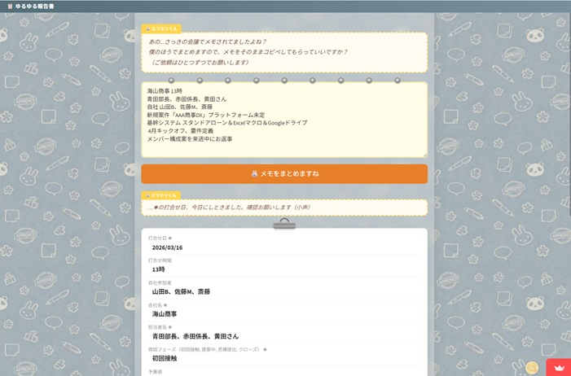

# 🐰 ゆるゆる報告書

> 雑なメモを、AIが整形。CRMにそのままコピペ。

[](https://yuruyuru-report.streamlit.app/)

 

---

## 📋 アプリ概要

外回り営業の「商談メモをCRMに入力する手間」を AI で解決するツールです。

箇条書きや走り書きのメモを入力するだけで、Groq AI が Salesforce などの CRM にコピペしやすい形式に整形します。モバイル対応済みなので、出先でもサクッと使えます。

**🔗 デモ：https://yuruyuru-report.streamlit.app/**

---

## ✨ 主な機能

| 機能 | 説明 |
|------|------|
| 📝 メモ整形 | 雑なメモを商談レコード形式に自動整形（Groq AI） |
| 🐰 ヒソヒソくん | 必須項目の空欄・複数案件の混在をこっそり指摘 |
| 🐼 プルプル部長 | 整形結果にひとこと添えて承認ハンコを押してくれる |
| 📋 ワンタップコピー | 整形結果をクリップボードにコピー（iOS Safari 対応） |
| 🔄 汎用テンプレ | 項目定義を JSON で外出しにしているので商談用・日報用・議事録用などに使い回せる |

---

## 🖥️ 画面構成

```
【1ページ目：メイン】
メモ入力（付箋スタイル）
　↓
「🐰 メモをまとめますね」ボタン
　↓
整形結果表示 ＋ ヒソヒソくんのチェック
　↓
クリップボードにコピー  /  プルプル部長に見せてみる🐼

【2ページ目：部長室】
整形結果 ＋ プルプル部長の一言 ＋ 承認ハンコ
　↓
← メインページに戻る
```

---

## 🛠️ 技術スタック

| 要素 | 内容 |
|------|------|
| フレームワーク | [Streamlit](https://streamlit.io/) |
| AI | [Groq API](https://groq.com/)（llama-3.3-70b-versatile） |
| 言語 | Python 3.x |
| デプロイ | Streamlit Community Cloud |
| 外部 API 連携 | なし（コピペ運用） |

---

## 💡 工夫したポイント

### AIプロンプト設計
- 出力を **JSON 形式で明示**することでパースを安定させた
- 「不明な場合は空文字」を徹底してハルシネーションを防止
- Groq を3回に分けて呼び出し（整形・複数案件判定・部長一言）、それぞれ責務を分離

### UI / UX
- **止めない・通す方針**：必須項目が空でもコピーも承認もできる。ヒソヒソくんは気づかせるだけ
- ページ遷移をまたいだ入力内容の保持：`memo_backup` キーで session_state を退避・復元
- iOS Safari ダークモード対策：テキストエリアの `caret-color` と `::placeholder` を明示
- コピーボタンは `st.components.v1.html()` で JS 実行（`st.markdown` では JS が無効化されるため）

### キャラクター設計
- 🐰 **ヒソヒソくん**：実は一番仕事できる。指摘はするがうるさくしない
- 🐼 **プルプル部長**：58歳・昭和の営業マン気質。ケチをつけるが最終的には必ず承認。18時以降・休日はコンプライアンスに配慮（ギャップ演出）

---

## 📁 ファイル構成

```
yuruyuru_report/
│
├── app.py                        # メインページ（入力・整形・ヒソヒソくん・コピー）
├── pages/
│   └── bucho.py                  # 部長室（ハンコ・一言・戻るボタン）
├── prompts/
│   ├── prompt_builder.py         # Groq①②のプロンプト生成
│   └── bucho_prompt.py           # Groq③部長プロンプト・時間判定
├── data/
│   ├── template_shidan.json      # 項目定義 JSON（商談用）
│   └── glossary.json             # 用語辞書 JSON
├── utils/
│   ├── groq_client.py            # Groq API 共通呼び出し
│   └── time_context.py           # 時間・曜日コンテキスト判定
├── assets/
│   ├── doodle_background_1600x900_soft_100kb.jpg
│   └── hanko.png                 # 承認ハンコ画像
├── .streamlit/
│   ├── secrets.toml              # APIキー（GitHub には上げない）
│   └── config.toml
├── requirements.txt
└── CLAUDE.md                     # AI 引継ぎ資料
```

---

## 🚀 ローカルで動かす

```bash
# 1. リポジトリをクローン
git clone https://github.com/<your-username>/yuruyuru_report.git
cd yuruyuru_report

# 2. 依存パッケージをインストール
pip install -r requirements.txt

# 3. APIキーを設定
#    .streamlit/secrets.toml を作成して以下を記載
#    GROQ_KEY = "your_groq_api_key"

# 4. 起動
streamlit run app.py
```

> **Groq API キーの取得**：https://console.groq.com/ から無料で取得できます。

---

## 🔮 今後の検討事項

- [ ] 項目 JSON の切り替え UI（商談用・日報用・議事録用など）
- [ ] 用語辞書の編集 UI
- [ ] Teams / LINE / LINE Works 連携（v2 以降）

---

## 👤 作者

Salesforce 実務経験 × AI 実装スキルの掛け合わせを示すポートフォリオとして開発しました。

<!-- TODO: 名前・SNSリンク・Zenn記事URLなどを追記してください -->
<!-- - Zenn: https://zenn.dev/yourname -->
<!-- - Twitter/X: @yourhandle -->
